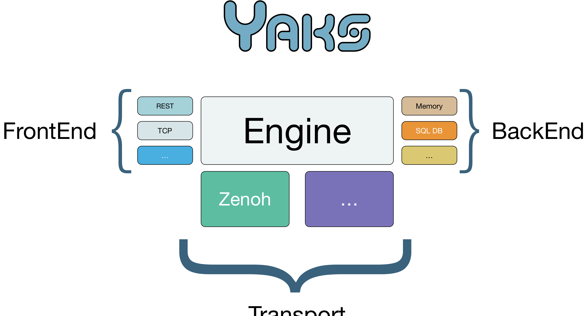

# YAKS Architecture

## Engine

Is the core of YAKS, it manages all the data flow, has pluggable BackEnd, FrontEnd and Transports.
It is responsible of:
- Authenticate the users
- Creating/Removing user groups
- Creating/Removing users
- Creating/Removing Access
- Creating/Removing Storages (if there is at least one backend)
- Put,Get, delta_put of data
- Security 

## FrontEnd

The FrontEnds are responsible for the communication between YAKS and the end users (applications)
They expose the YAKS services using different technologies, they are the implementation of the YAKS Client API
They are also responsible of mantaining the session information for logged users.
They have also mechanisms for notifing be notified by the engine if data are updated (in case there is a subscription they may need to notify also the end user)

## BackEnd

The Backend are responsible for the actual storage of the data coming into YAKS.
They have also mechanisms for notifing the engine that the data are updated from another process (in the case of a DB Backend, data may be updated by legacy applications)

## Transport
The Transports are responsible of the data sharing between different YAKS, they should allow the efficent data distribution as well as allow runtime discovery and provide
the cache resolving algorithms